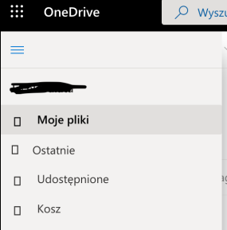
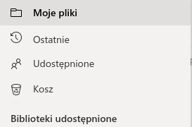

# OneDriveFonts

## Problem
Ikony Microsoft w usłudze OneDrive nie są widoczne na systemach Linux/MacOS.  
Linux/MacOS:  
  
Windows (oczekiwany wynik):  

## Przyczyna
Powyższe ikony pochodzą oryginalnie (na Windowsie) z pakietu *FabricMDL2Icons*, który na Windowsach jest dostępny lokalnie, a na innych systemach powinien być pobierany z serwera. Problem polega na tym, że w przypadku polskiej wersji OneDrive'a docelowa rodzina czcionek *FabricMDL2Icons* została nadpisana przez pakiet *Segoe UI Web (East European)*, który nie zawiera powyższych ikon. Inaczej, algorytm wybierania odpowiedniego pakietu czcionek przegląda dostępną listę pakietów na której w pierwszej kolejności rozważa *Segoe UI Web (East European)* (dostępny z serwera) oraz uznaje go za "poprawnego", więc go wykorzystuje nie przeglądając reszty pakietów. W takim razie pakiet *FabricMDL2Icons* nie jest wogóle importowany, czyli nie mamy dostępu do ikon.
## Rozwiązanie
Ponieważ błąd jest spowodowany nieumyślnym bugiem w kodzie po stronie Microsoftu jedyne eleganckie rozwiązanie wymagało kontaktu z supportem.  
Po opisaniu problemu na forum Microsoftu (dostępne [tutaj](https://answers.microsoft.com/en-us/msoffice/forum/msoffice_drive-mso_mac-mso_online/bug-onedrive-doesnt-display-icons/bca76f5e-08f7-4ebe-9dca-a6479313abea?messageId=aeecb213-5777-46ec-b54f-a6f45508bb0d&fbclid=IwAR25JUuZoUyXLt_5kdmVnld9Pl6FH689bB4l7BNZ0fIsa9VPaefxQc-BbWE)) skontaktowaliśmy się z adminem organizacji OneDrive'a wersji UJowej.  
Obecna wersja OneDrive'a została już naprawiona przez importowanie odpowiedniego pakietu *FabricMDL2Icons*.
